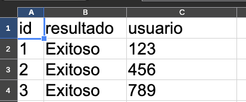
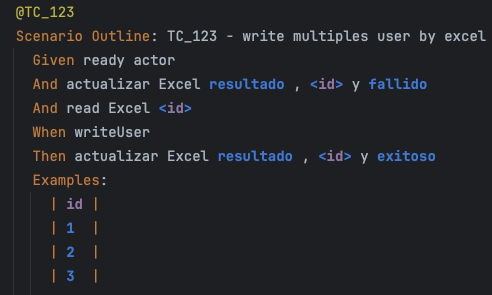
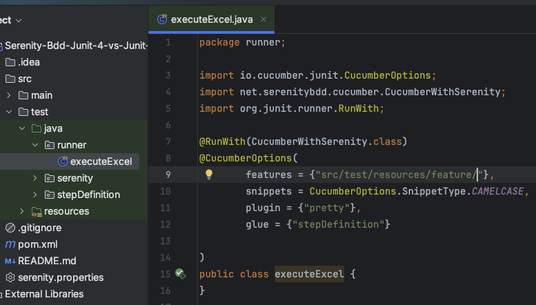
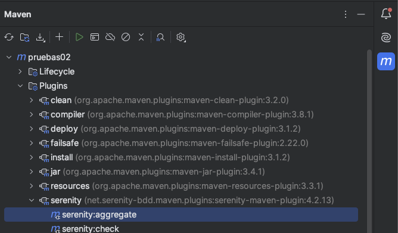

# Serenity BDD y Excel Data Source
```bash
Aclaración, No existe compatibilidad de serenity bdd y cucumber con excel, el siguiente es un ejemplo utilizando la libreria poi
```
Este proyecto es una plantilla de automatización de pruebas BDD y aprovecha archivos Excel como fuente de datos para escenarios de prueba.

La idea es que no importa la N cantidad o posición de columnas que esten en el excel
## Derechos
```bash
Autor : jeisson cardenas
Github : https://github.com/testingConGatos
Youtube :  https://www.youtube.com/@testingcongatos
```
🚀 Empezando
Prerrequisitos
Asegúrate de tener instalado lo siguiente:

Java JDK (versión 17 o superior)
Maven (para la gestión del proyecto y sus dependencias)
IntelliJ IDEA

💻 Uso
1. Preparar los datos de prueba
   Abre el archivo src/test/resources/data/excelTest.xlsx, cambia los valores de la columna 'usuario'.

2. Ejecutar la clase executeExcel ubicada en la carpeta runner, para iniciar La automatización
    1. Inicia el actor y abre el navegador chrome y se dirige a la ruta https://qa-practice.netlify.app/auth_ecommerce
    2. Realiza 1 ejecución por cada fila en el examples ubicado en el feature, el actor guardara los datos de la fila en el excel que la columna 'id' sea igual a la columna 'id' en cada feature.
    3. En el inicio del escenario la columna resultado se pondra en estado fallido y al finalizar la prueba cambiara el estado a exitoso
   - excel
   - 
   - feature 
   - 
   
3. Ejecutar la prueba de escritura del usuario
4. Si ejecuto desde el runner.
   - 
    Recordar generar el reporte con la opción serenity:aggregate
   - 

📂 Estructura del Proyecto
El proyecto sigue una estructura típica de Serenity BDD con Maven:

- src/test/java/runner: Contiene la clase java con la que se ejecutara la prueba.
- src/test/resources/feature: Aquí se encuentran los archivos .feature de Gherkin que describen los escenarios de prueba.
- stepDefinition: Las clases que implementan los pasos de Gherkin (@Given, @When, @Then).
- serenity: El código del modelo de objetos de página (PageObjects) o el modelo de pantalla (Screenplay), según tu implementación.
- src/test/resources/data: El directorio donde se almacenan los archivos .xlsx con los datos de prueba.
- serenity.properties: Archivo de configuración para Serenity BDD.
- pom.xml: El archivo de configuración de Maven.

🧐 Pendientes por implementar
- Manejo de columnas vacias
